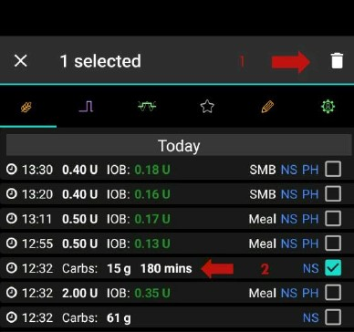

# Berechnung der aktiven Kohlenhydrate (COB)

## Wie berechnet AAPS die aktiven Kohlenhydrate?

Wenn Kohlenhydrate im Rahmen einer Mahlzeit oder als Kohlenhydrat-Korrektur eingegeben werden, wird **AAPS** diese Kohlenhydrate zu den aktiven Kohlenhydraten (**COB**) hinzurechnen und bei den Berechnungen berücksichtigen. **AAPS** berechnet dann die Kohlenhydrat-Aufnahme (Absorption) des Nutzenden anhand der zu den **Glukosewerten** beobachteten Abweichungen. Die Absorptionsrate hängt vom Kohlenhydrat-Empfindlichkeitsfaktor (**"CSF"**) ab. Diese Funktionalität ist nicht im **Profil** hinterlegt, sondern wird durch **AAPS** anhand des hinterlegten **ISF/IC**-Verhältnisses berechnet. Es sagt aus, um wie viel mg/dl der **Glukosewerte** bei der Aufnahme von 1g Kohlenhydraten steigt.

## Faktor der Kohlenhydrat-Empfindlichkeit (Carb Sensitivity Factor)

Die in **AAPS** genutzte Formel ist:

- Aufgenommene KH = Abweichung * IC / ISF.

Der Effekt auf das **Profil** ist:

- _Erhöhung_ **IC** - Durch das Erhöhen des Wertes der in 5 Minuten aufgenommen Kohlenhydrate verkürzt sich die Gesamtzeit der KH-Absorption;

- _Erhöhung_ **ISF** - Durch das Reduzieren des Wertes der in 5 Minuten aufgenommenen Kohlenhydrate verlängert sich die Gesamtzeit der KH-Absorption; und

- _Prozentuale Änderung_ des **Profils** -  Erhöhen/reduzieren beider Werte hat keinen Einfluss auf die Gesamtzeit der KH-Absorption.

Wenn der **ISF** im **Profil**  beispielsweise 100 und der **IC** 5 ist, wäre der Faktor der Kohlenhydrat-Empfindlichkeit (CSF) 20. Pro 20 mg/dl um die der **Glukosewert** steigt, berechnet **AAPS** 1 g Kohlenhydrate als absorbiert. Eine positiver **IOB**-Wert beinflusst damit auch die **COB**-Berechnung. Wenn **AAPS** vorhersagt, dass der **Glukosewert** aufgrund des aktiven Insulins (**IOB**) um 20 mg/dl sinken wird, und dieser aber stabil bleibt, werden durch **AAPS** dennoch 1 g Kohlenhydrate als absorbiert kalkuliert.

In Abhängigkeit vom von Dir in **AAPS** gewählten Empfindlichkeits-Algorithmus, werden auch Kohlenhydrate nach dem unten beschriebenen Verfahren aufgenommen (absorbiert).

## Kohlenhydrat-Empfindlichkeit (Carb Sensitivity) - Oref1

Nicht absorbierte Kohlenhydrate werden nach der eingestellten Zeit verworfen, werden also bei Berechnungen nicht mehr berücksichtigt:

## Kohlenhydrat-Empfindlichkeit - Gewichteter Mittelwert

Absorption is calculated to have COB = 0 after specified time:

If minimal carbs absorption (min_5m_carbimpact) is used instead of value calculated from **BG** deviations, an orange dot appears on the **COB** graph.

(CobCalculation-detection-of-wrong-cob-values)=
## Erkennung Fehlerhafter COB-Werte

**AAPS**  will warn the user if they are about to bolus with **COB** from a previous meal if the algorithm detects current **COB** calculation as incorrect. In this case it will give the user an additional hint on the confirmation screen after usage of bolus wizard.

### Wie erkennt AAPS falsche COB-Werte?

Ordinarily __AAPS__ detects carb absorption through **BG** deviations. Incase the user has entered carbs but **AAPS** cannot detect their estimated absorption through **BG** deviations, it will use the [min_5m_carbimpact](#Preferences-min_5m_carbimpact) method to calculate the absorption instead (so called ‘fallback’). As this method calculates only the minimal carb absorption without considering **BG** deviations, it might lead to incorrect COB values.

In the screenshot above, 41% of time the carb absorption was calculated by the min_5m_carbimpact instead of the value detected from deviations. This indicates that the user may have had less **COB** than calculated by the algorithm.

### Wie kann man mit dieser Warnung umgehen?

- Denke darüber nach die Insulinabgabe abzubrechen - drücke 'Abbrechen' statt OK.
- Berechne die Mahlzeit mit dem Bolus-Rechner erneut, nimm aber den Haken bei **COB** heraus.
- Solltest Du einen Korrekturbolus brauchen, gib ihn manuell ein.
- Vermeide Überdosierung und sog. Insulin Stacking (Überlagerung einzelner Bolus-Wirkkurven)!

### Warum erkennt der Algorithmus COB nicht richtig?

This could be because:
- Die Kohlenhydratmenge wurde bei der Eingabe potenziell überschätzt.
- Sportliche Aktivität oder Bewegung nach der vorangegangenen Mahlzeit.
- Dein IC-Wert (dt. KH-Faktor) muss angepasst werden.
- Dein Wert für min_5m_carbimpact ist falsch (für SMB wird 8 empfohlen, 3 für AMA).

## Manuelle Korrektur der eingegebenen Kohlenhydrate

If carbs are over or underestimated carbs this can be corrected through the Treatments tab and actions tab / menu as described [here](#screens-bolus-carbs).

## Kohlenhydrate korrigieren - wie KH-Einträge aus den Behandlungen gelöscht werden

The ‘Treatments’ tab can be used to correct a faulty carb entry by deleting the entry in Treatments. This may be because the user over or underestimated the carb entry:

1. Überprüfe und merke Dir die aktuellen **COB**- und **IOB**-Werte der **AAPS**-Übersicht.
2. Abhängig von der Pumpe können die Kohlenhydrate in den Behandlungen in einer Zeile mit der Insulinmenge oder in zwei Zeilen als separater Eintrag (z.B. bei der Dana RS) angezeigt werden.
3. Entferne den Eintrag, indem Du zuerst auf den Papierkorb in der oberen rechten Ecke tippst (siehe oben, Schritt 1). Dann markiere die fehlerhafte KH-Menge (siehe oben, Schritt 2). Dann tippe erneut auf den Papierkorb oben rechts (noch einmal Schritt 1).
4. Kontrolliere, dass die Kohlenhydrate tatsächlich entfernt wurden, indem Du den **COB**-Wert auf der **AAPS**-Übersicht noch einmal überprüfst.
5. Mache das gleiche für **IOB** falls bei Dir im Reiter 'Behandlungen' KH und Insulin zusammen in einer Zeile angezeigt werden.
6. Wenn die KH nicht wie vorgesehen entfernt wurden und zusätzliche KH hinzugefügt werden, ist der **COB**-Eintrag zu hoch. Das kann dazu führen, dass **AAPS** zu viel Insulin abgibt.
7. Gib die richtige Kohlenhydratmenge über den Button auf der **AAPS**-Übersicht ein und gib die dazu passende Uhrzeit mit an.
8. Falls bei Dir im Tab 'Behandlungen' KH und Insulin zusammen in einer Zeile angezeigt werden musst Du zusätzlich die Insulinmenge neu eingeben. Achte auch hier auf die Auswahl des richtigen Zeitpunkts und prüfe im Anschluss **IOB** auf der Übersicht.

