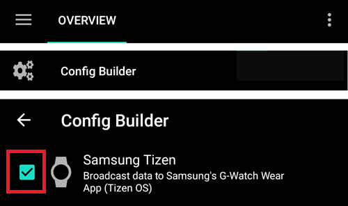
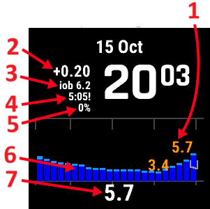

# Smartwatches and AAPS

Various smartwatches can be used to display some of the information available in **AAPS** or perform remote actions.

Having a smartwatch directly control **AAPS** (pump and sensor) is achieved using full Android watches (that are considered like small [smartphones](./Phones.md)).

Some smartwatches can allow you to enter treatments, or more, but with the phone itself still managing **AAPS**.

Smartwatches werden mehr und mehr mit **AAPS**,_sowohl_ für Erwachsene mit Diabetes, als Betreuende/Eltern von Kindern mit Diabetes, eingesetzt.

## Generelle Vorteile Smartwatches mit **AAPS** zu nutzen


Smartwatches können - je nach Modell - auf unterschiedliche Weise mit **AAPS** genutzt werden. Sie können **AAPS**ganz oder teilweise steuern oder einfach verwendet werden, um Glukosewerte, aktives Insulin und andere Parameter remote zu überprüfen.

Die Integration einer Smartwatch mit **AAPS** kann in vielen Situationen nützlich sein. Z.B. beim Auto- oder Motorradfahren oder bei sportlichen Aktivitäten. Für manche Menschen ist ein kurzer Blick (z. B. in Besprechungen, auf einer Party oder beim Abendessen) auf die Smartwatch deutlich diskreter als der Blick auf das Smartphone. Von einem Sicherheitsaspekt ist eine Smartwatch, wenn man unterwegs ist, besonders hilfreich. Das **AAPS**-Smartphone kann (z. b. in der Tasche) verstaut bleiben und AAPS kann über die Smartwatch gesteuert werden.

## Besondere Vorteile für **AAPS**-nutzende Eltern/Betreuende

Ist das **AAPS**-Smartphone in der Nähe des Kindes, kann der Betreuende die Smartwatch zur Kontrolle nutzen und Anpassungen über die Smartwatch vornehmen, ohne dass das **AAPS**-Smartphone berührt werden muss. Das kann besonders komfortabel sein, wenn das **AAPS**-Smartphone in einem Pumpengürtel versteckt getragen wird.

A smartwatch can be used either _in addition_ to, or as an _alternative_ to the PHONE-based options for remote control or [following only](../RemoteFeatures/FollowingOnly.md).

Additionally, unlike parent/caregiver follower phones (which rely on the mobile network or Wi-Fi connection), Bluetooth connected smartwatches can be useful in remote locations, like a cave, in a boat, or half-way up a mountain. Wenn sich sowohl das **AAPS**-Smartphone, als auch die Smartwatch im gleichen WLAN befinden, kann auch die WLAN-Verbindung genutzt werden.

## Verschiedene Arten die Smartwatch mit AAPS zu nutzen

Derzeit gibt es fünf Möglichkeiten, Smartwatches mit **AAPS** zu verwenden. Diese werden in der folgenden Tabelle beschrieben: 

| Watch Setup         | Features                            | Voraussetzungen                                                                                                                                                                                                                                       |
| ------------------- | ----------------------------------- | ----------------------------------------------------------------------------------------------------------------------------------------------------------------------------------------------------------------------------------------------------- |
| Standalone          | AAPS without a phone                | Full Android smartwatch (check min Android)</br> Running **app-fullRelease**                                                                                                                                                                          |
| Full remote control | Most AAPS functions                 | Android **Wear OS** watch (check Android/API)</br>Running **wear-fullRelease**                                                                                                                                                                        |
| Remote control      | AAPSClient functions                | Android **Wear OS** watch (check Android/API)</br>Running **[wear-aapsclientRelease](https://github.com/nightscout/AndroidAPS/releases)**                                                                                                             |
| Remote control      | Some AAPSClient functions           | Some Samsung, Fitbit and Garmin watches</br>See below.                                                                                                                                                                                                |
| Display             | Display some AAPSClient indications | Many smartwatches (see [here](https://bigdigital.home.blog/))</br>[xDrip+](https://github.com/nightscoutfoundation/xdrip/releases) and [WatchDrip+](https://bigdigital.home.blog/2022/06/16/watchdrip-a-new-application-for-xdrip-watch-integration/) |

## Bevor Du Dir eine Smartwatch kaufst …

Welches genau Modell Du kaufen solltest, hängt von den gewünschten Funktionalitäten ab. You may find useful information on the [Phones page](#Phones-list-of-tested-phones), including a list a tested phones that also contains some smartwatches.

Zu den beliebten Smartwatch-Marken gehören Samsung Galaxy, Garmin, Fossil, Mi Band und Fitbit. The different options summarized in the Table above are explained in more detail below, to help you decide which smartwatch is right for your situation.

Wenn Du eine Smartwatch mit dem Ziel das **AAPS**-Smartphone remote steuern zu wollen anschaffst, solltest Du insbesondere darauf achten, dass beide Geräte kompatibel zueinander sind (besonders dann, wenn Du ein älteres oder ungewöhnliches Smartphone hast).

Wenn Du nur die Glukosewerte sehen möchtest, und darüber hinaus nicht mit **AAPS** interagieren möchtest, steht Dir eine größere Auswahl an einfachen, erschwinglichen Smartwatches zur Verfügung.

Der beste Weg, eine Smartwatch auszusuchen, ist in den entsprechenden **AAPS** Discord- oder Facebook-Gruppen nach Beiträgen mit dem Stichwort "watch" zu suchen. Lies und profitiere von den Erfahrungen anderer. Wenn Deine Frage nicht durch bestehende Beiträge beantwortet wird, stelle spezifische Fragen.

## Full Android

Klingt attraktiv, oder? Wie dem auch sei, momentan experimentieren nur wenige Enthusiasten mit **AAPS**  auf einer Standalone Smartwatch. Es gibt nur wenige Smartwatches mit einer vernünftigen Bedienoberfläche, die auch gut mit **AAPS** und Deiner CGM App funktionieren. Beliebte Modelle sind u. a. die LEMFO LEM 14, 15 und 16. Du musst die vollständige **AAPS** APK (die Apk, die normalerweise auf einem Smartphone installiert wird) anstelle der **AAPS** "wear" apk auf die Smartwatch laden.

Auch wenn es derzeit keinen eindeutigen Spezifikationen gibt, die erkennen lassen, ob eine Smartwatch als Standalone **AAPS** nutzbar ist, gibt es einige Parameter, die gute Indikatoren sind:

1) Android 10 oder höher. 2)  Die Möglichkeit zu haben das Zifferblatt aus dem "Square-Modus" zu holen, um Text zum einfacheren Lesen zu vergrößern. 3) Sehr gute Akkulaufzeit. 4)  Good Bluetooth range.

Die meisten Frustrationen mit Standalone **AAPS**-Smartwatches entstehen aus der Interaktion mit einem winzigen Bildschirm, und der Tatsache, dass die aktuelle AAPS-Voll-App-Benutzeroberfläche nicht für eine Smartwatch konzipiert wurde. Durch das sehr eingeschränkte Display und kann ein Stift beim Editieren der **AAPS**-Einstellungen helfen. Einige der AAPS-Tasten sind möglicherweise auf dem Zifferblatt nicht sichtbar.

Ein weiteres Problem ist es eine Smartwatch mit langer Akkulaufzeit, die in der Regel klobig und dick sind, zu finden. Users report fighting with the OS and power-saving settings, difficulty in starting sensors on the watch, poor Bluetooth range (for maintaining connection with both the sensor and pump) and questionable water resistance. Examples are shown in the photos below.


Wenn Du eine Standalone Smartwatch aufsetzen möchtest und Zusatzinformationen benötigst, lies' die Beiträge und Kommentare in der **AAPS** -Facebookgruppe (Suchwörter: “standalone” und “Lemfo”) oder auf Discord.

## Wear OS

**AAPS** code contains an app extension that can be installed on [**Wear OS** smartwatches](https://wearos.google.com/#oem-carousel).


Verify your smartwatch satisfies **AAPS** [prerequisites](#maintenance-android-version-aaps-version).

### What _is_ Wear OS?

Die ersten drei Smartwatch-Optionen setzen **Wear OS** als Betriebssystem voraus.

**Wear OS** ist das Betriebssystem, das auf einigen modernen Android Smartwatches läuft. In [2018](https://en.wikipedia.org/wiki/Wear_OS) hat Google _Android Wear 1.x in Wear OS_ ab Version 2.x umbenannt. Wenn also ein Gerät mit “_Android Wear_” anstatt mit **Wear OS** gekennzeichnet ist, kann das auf eine ältere Version hinweisen. Wenn die Smartwatch nur als _kompatibel_ mit Android und iOS beschrieben wird, bedeutet das nicht, dass sie Wear OS verwendet. Möglicherweise handelt es sich dann dabei um ein anderes Betriebssystem, das nicht mit **AAPS** kompatibel ist. Eine Smartwatch sollte **WearOS** und idealerweise Android 10 (oder neuer) nutzen, um die verschiedenen Versionen von **AAPS** oder dem **AAPSClient** voll nutzen zu können. Im Oktober 2023 war die aktuelle **WearOS**-Version WearOS 4.0 (mit Android 13 als Basis).

If you install **AAPS** wear.apk on a **Wear OS** watch, there are a range of different custom **AAPS** watchfaces which can be selected. Alternativ kannst Du auch das Standard-Ziffernblatt Deiner Smartwatch mit **AAPS** Informationen erweitern (sog. "complications"). A complication is any feature that is displayed on a watchface in addition to the time. Komplikationen sind ab Wear OS Version 2.0 oder höher verfügbar.


### What could my smartwatch look like?

After [installing **AAPS** onto your watch](../WearOS/WearOsSmartwatch.md), you will automatically be able to select your preferred watchface from these **AAPS**-dedicated watchfaces. On most watches, you simply long-press on the home screen until the screen shrinks and swipe right to select an alternative screen:


These are the basic screens embedded in **AAPS**, there are [more watchfaces](#WearOS_changing-to-AAPS-watchface) and you can also use [complications](#Watchfaces-complications).

### Wie würde ich eine Wear OS Smartwatch im Alltag nutzen?

Further details about the watchfaces, and day-to-day use, including how to make (and share) your own customized watchface, can be found in the section [Operation of Wear AAPS on a Smartwatch](../WearOS/WearOsSmartwatch.md).

(Watchfaces-tizen)=

## Samsung Tizen

**AAPS** supports sending data to the [G-Watch app](https://play.google.com/store/apps/details?id=sk.trupici.g_watch).

Please check the dedicated [Facebook group](https://www.facebook.com/groups/gwatchapp) for latest news.



(Watchfaces-garmin)=

## Garmin

There are a some watch faces for Garmin that integrate with [AAPS](https://apps.garmin.com/search?keywords=androidaps), on the Garmin ConnectIQ store.


[AAPS Glucose Watch](https://apps.garmin.com/apps/3d163641-8b13-456e-84c3-470ecd781fb1) integrates directly with **AAPS**. It shows loop status data (insulin on board, temporary basal) in addition to glucose readings and sends heart rate readings to **AAPS**. It is available in the ConnectIQ store, the necessary **AAPS** plugin is only available from **AAPS** 3.2. 


## Fitbit

```{Warning}
Google is phasing out Fitbit products. Custom watchfaces are not available in Europe anymore (you need to use a VPN). Purchasing a Fitbit now is not recommended.
```

**AAPS** supports sending data to the [Sentinel](http://ryanwchen.com/sentinel.html) watchface.


**"Sentinel"** ist ein Zifferblatt für die Fitbit-Smartwatch, das von [Ryan Chen](http://ryanwchen.com/sentinel.html) für seine Familie entwickelt wurde und kostenlos geteilt wird: Sense1/2, Versa 2/3/4. Das Zifferblatt ist nicht mit der Fitbit Luxe (als ein reiner Fitness-Tracker) kompatibel. Sentinel kann aus der [Fitbit-Mobile App](https://gallery.fitbit.com/details/5f75448f-413d-4ece-a53d-b969c6afea7c) heruntergeladen werden.

Damit wird es möglich Glukosewerten von bis zu drei Personen über Dexcom Share, Nightscout oder einer Kombination aus den beiden Datenquellen, zu folgen.

Wenn xDrip+ oder die SpikeApp im lokalen Webserver Modus laufen, können auch diese genutzt werden. Man kann individuelle Alarme einrichten und Ereignisse über die Nightscout-Careportal-Funktionalität direkt von der Smartwatch eintragen und so leichter die Glukosewerte, das aktive Insulin (IOB) und die wirksamen Kohlenhydrate (COB) im Auge behalten und auch Mahlzeit-Informationen (Kohlenhydrate und Bolus) eingeben.

Diese Informationen und Ereignisse erscheinen (inkl. der aktualisierten Werte für IOB und COB) in der Nightscout-Übersicht. Unterstützung aus der Community findest Du in der [Facebook-Gruppe, Sentinel](https://www.facebook.com/groups/3185325128159614).

Für Fitbit-Uhren gibt es noch andere Möglichkeiten, die sich allerdings auf die reine Anzeige beschränken. Dazu gehört auch [Glance](https://glancewatchface.com/). Diese zusätzlichen Optionen sind in den [Nightscout Webseiten](https://nightscout.github.io/nightscout/wearable/#fitbit) beschrieben.

## Following only

These smartwatches will reflect some **AAPS** information, some will require other apps.

Es gibt eine große Auswahl an erschwinglichen Smartwatches, die Glukosewerte anzeigen können. Nutzt Du Nightscout, findest Du einen guten Überblick über die verschiedenen Möglichkeiten auf den [Nightscout-Seiten](https://nightscout.github.io/nightscout/wearable/#).

Here below some of the follow-only watch options popular with **AAPS** users:

### **Xiaomi and Amazfit watches**

[Artem](https://github.com/bigdigital) hat die xDrip-Integration für verschiedene Smartwatch Modelle entwickelt, hauptsächlich für Xiaomi (_z. B._ MiBand) und Amazfit-Modelle:


You can read more about them, including how to set up at his website [here](https://bigdigital.home.blog/). The advantage of these watches is that they are small and relatively affordable. Sie sind insbesondere für Kinder und Menschen mit dünnen Handgelenken interessant.

### Pebble watch


Pebble watches ([now discontinued](https://en.wikipedia.org/wiki/Pebble_(watch))) were on general sale from 2013 to 2016, and may still be available second-hand. Fitbit übernahm das Pebble-Vermögen. Pebble-Nutzende können die Urchin Uhr verwenden, um Nightscout-Daten anzuzeigen. Informationen, die angezeigt werden: Aktives Insulin, die aktive temporäre Basalrate und Glukosewert-Vorhersagen. Wenn Du im "Open Loop" unterwegs bist, kannst Du mit IFTTT ein Applet erstellen, das Dir eine SMS oder eine Echtzeit-Benachrichtigung (pushover notification) schickt, wenn eine **AAPS**-Benachrichtigung eingegangen ist.

### [Bluejay watches](https://bluejay.website/)


These are unique pieces of technology which can receive glucose data **directly** from the Dexcom transmitter. It is not widely known that Dexcom G6/G7 transmitters actually broadcasts the current glucose data on _two_ separate channels, a phone channel and a medical channel. The Bluejay watches can be set to receive glucose data on either channel, so if **AAPS ** is using the phone channel, then the Bluejay watches can use the medical channel.

Sie ist derzeitig die einzige Smartwatch, die ohne Smartphone und Loop-System in der Nähe genutzt werden kann. So, for example, if you disconnect the pump and the **AAPS** phone at the beach or flume park, and are out of range of the **AAPS** phone, you can still get readings from your Dexcom directly to the Bluejay watch.

Reported disadvantages are that it doesn’t always pick up a reading every 5 min, and the battery is not replaceable. The Bluejay GTS watch runs a modified version of xDrip+ software whilst the Bluejay U1 runs full xDrip+.

### Apple watch

Check [Nightscout on your watch](https://nightscout.github.io/nightscout/wearable/#).

The Apple watch now supports G7 direct connection and can be used simultaneously with **AAPS**.

