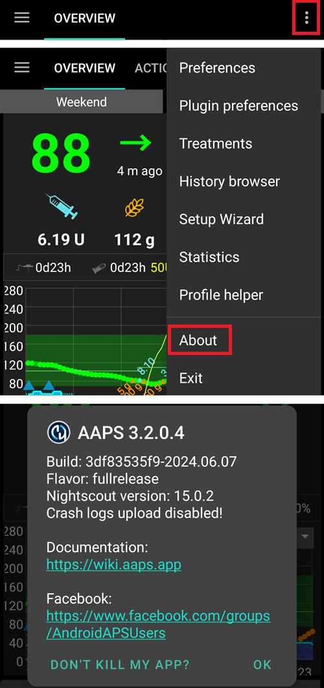

# Update auf eine neue Version oder einen Branch

## Notes for specific versions

* [Update to AAPS 2.7](../Maintenance/Update2_7.md)
* [Update to AAPS 3.0](../Maintenance/Update3_0.md)

## Kein Download möglich - APK muss selbst erstellt werden

Aufgrund der gesetzlichen Regelungen für Medizinprodukte ist **AAPS** nicht als Download verfügbar. Es ist zulässig, die App für den eigenen Gebrauch zu erstellen, aber du darfst keine Kopie an andere weitergeben! See [FAQ page](../UsefulLinks/FAQ.md) for details.

## Wichtige Hinweise

* Aktualisiere so bald wie möglich auf die neueste **AAPS**-Version, nachdem sie verfügbar ist.
* Sobald eine neue Version verfügbar ist, wird Dir in der **AAPS**-App ein Hinweis darüber angezeigt.
* Wenn eine neue Version verfügbar ist, wird darüber auch auf Facebook informiert.
* Following the release, please read the [Release Notes](ReleaseNotes.md) in detail, and clarify any queries with the community on Facebook or Discord, before proceeding with the update.
* You need to use version **[Android Studio version called at least Hedgehog (2023.1.1) or one more recent like Iguana, Jellyfish, Koala or Ladybug](https://developer.android.com/studio/)** of Android Studio. Nutzt Du derzeit eine ältere Version, aktualisiere bitte zuerst Dein Android Studio! 

## Übersicht zum Aktualisieren auf eine neue AAPS Version

1. [Export your settings](ExportImportSettings.md) from the existing **AAPS** version on your phone. Vielleicht brauchst Du sie nicht, aber sicher ist sicher.
2. [Update local copy](Update-to-new-version-update-your-local-copy) of the AAPS sourcecode (Git->Fetch and Git -> Pull)
3. [Erstelle die signierte APK](Update-to-new-version-build-the-signed-apk)
4. [Transfer the built apk](Update-to-new-version-transfer-and-install) to your phone and install it
5. [Check the version](Update-to-new-version-check-aaps-version-on-phone) in AAPS
6. Depending on your [BG source](../Getting-Started/CompatiblesCgms.md) make sure to [identify receiver](#xdrip-identify-receiver) in xDrip or use the ['Build your own Dexcom App'](#DexcomG6-if-using-g6-with-build-your-own-dexcom-app).

In case you experience problems, see separate page for [troubleshooting Android Studio](../GettingHelp/TroubleshootingAndroidStudio).

## 1. Exportiere Deine Einstellungen

See the [Export & import settings](ExportImportSettings.md) page if you don't remember how to do this.

(Update-to-new-version-update-your-local-copy)=

## 2. Führe ein Update deiner lokalen Version durch

```{admonition} WARNING :class: warning If you update from versions prior to 2.8.x, please follow the instructions to do a [New clone](../Installing-AndroidAPS/building-AAPS), as this guide will not work for you!

    <br />* Open your existing AAPS project with Android Studio. You might need to select your project. (Double) click on the AAPS project.
    
      
    
    * In the menu bar of Android Studio, select Git -> Fetch
    
       
    
    * You will see a message in the lower right corner that Fetch was successful.
    
       
    
    * In the menu bar, now select Git -> Pull
    
         
    
    * Leave all options as they are (origin/master) and select Pull
    
       
    
    * Wait while download is in progress, you will see this as info in the bottom bar. Eine Erfolgsmeldung wird angezeigt, so bald erfolgreich heruntergeladen wurde.
    
      ```{note}
      The files that were updated may vary! This is not an indication
      ```
    
       
    
    * Gradle Sync will be running to download some dependencies. Warte, bis es fertig ist.
    
      
    
    (Update-to-new-version-build-the-signed-apk)=
    ## 3. Build the Signed APK
    
    Your sourcecode is now the current released version. It's time to build the signed apk from it as described in the [build signed apk section](#Building-APK-generate-signed-apk).
    
    (Update-to-new-version-transfer-and-install)=
    
    ## 4. Transfer and install the apk
    You need to transfer the apk to your phone so you can install it.
    
    ```{note}
    If you completed the build with the same existing key store in Android Studio, then you do not need to remove the existing app on your phone. Um die APK zu installieren, folge den Anweisungen während des Updatevorgangs.
    In allen anderen Fällen (z.B. wenn ein neuer 'key store' für das Signieren der APK genutzt wurde), muss die alte App gelöscht werden, bevor die neue Version installiert werden kann. **Make sure to export your settings!**
    

See the instructions for [transferring and installing AAPS](../SettingUpAaps/TransferringAndInstallingAaps.md)

(Update-to-new-version-check-aaps-version-on-phone)=

## 5. AAPS-Version auf dem Smartphone überprüfen

Nachdem Du die neue APK-Datei installiert hast, kannst Du auf dem Smartphone die Version prüfen. Gehe dazu oben rechts auf die drei Punkte und wähle dann "Über". Du solltest die aktuelle Version angezeigt bekommen.



## Troubleshooting

Keine Panik, wenn irgendetwas schiefläuft.

Tief durchatmen!

Then see the separate page [troubleshooting Android Studio](../GettingHelp/TroubleshootingAndroidStudio) if your problem is already documented!

Wenn Du weitere Hilfe brauchst, kontaktiere bitte andere **AAPS**-Nutzende auf [Facebook](https://www.facebook.com/groups/AndroidAPSUsers) oder [Discord](https://discord.gg/4fQUWHZ4Mw).