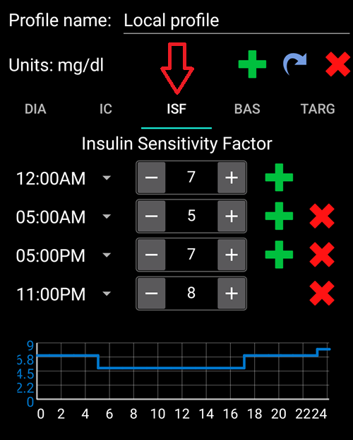
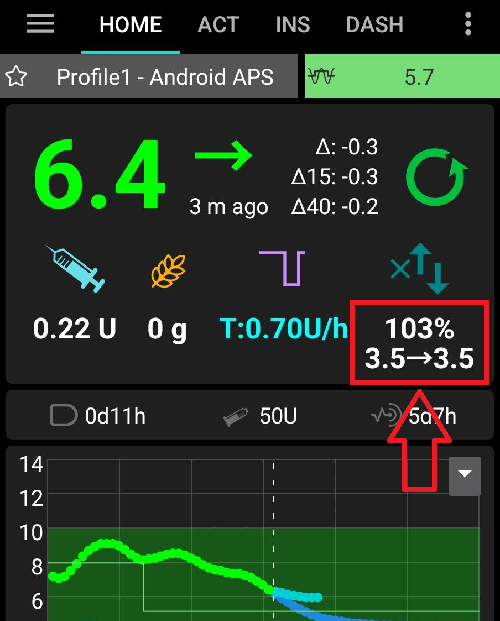

(Open-APS-features-DynamicISF)=
# DynamicISF (DynISF)
**Dynamic ISF** was added in **AAPS** version 3.2 and requires Objective 11 to be started before **Dynamic ISF** can be activated. Select **Dynamic ISF** in the Config Builder > **AAPS** to activate. **Dynamic ISF** is recommended only for advanced users that have a good handle on their **AAPS'** controls and monitoring.

To use **Dynamic ISF** effectively, **AAPS'** database requires a minimum of five (5) days of the user's **AAPS** data.

**Dynamic ISF** adapts the user's insulin sensitivity factor (**ISF**) dynamically based on the user's:

- Total Daily Dose of insulin (**TDD**); and
- current and predicted blood glucose values.

**Dynamic ISF** uses Chris Wilson’s model to determine **ISF** instead of a user's static **Profile's** settings for **ISF**.

The **Dynamic ISF**  equation implemented is: ISF = 1800 / (TDD * Ln (( glucose / insulin divisor) +1 ))

SMB/AMA - an example of a user's **Profile** with static **ISF** as set by the user and utilized by **SMB** and **AMA**.

Dynamic ISF - an example of a user's **ISF** subject to change as determined by **Dynamic ISF**.

The implementation uses the above equation to calculate current **ISF** and in the oref1 predictions for **IOB**, **ZT** and **UAM**. It is not used for **COB**.  Further discussion can be found here: https://www.youtube.com/watch?v=oL49FhOts3c.

## TDD (Total Daily Dose)
TDD will use a combination of the following values:
1.  7 day average **TDD**;
2.  the previous day’s **TDD**; and
3.  a weighted average of the last eight (8) hours of insulin use extrapolated out for 24 hours.

The **TDD** used in the above equation is weighted one third to each of the above values.

## Insulin Divisor
El divisor de insulina depende del pico de la insulina utilizada y es inversamente proporcional al tiempo del pico máximo. Para Lyumjev, este valor es 75, para Fiasp, 65 y para la insulina rápida regular, 55.

## Dynamic ISF Adjustment Factor
The Adjustment Factor allows the user to specify a value between 1% and 300%. This acts as a multiplier on the **TDD** value and results in the **ISF** values becoming *smaller* (i.e. more insulin required to move glucose levels a small amount) as the value is increased above 100% and *larger* (i.e. less insulin required to move glucose levels a small amount) as the value is decreased below 100%.

The Adjustment Factor can be located in ‘Preferences’ > **AAPS**:

## Future ISF

Future **ISF** is used in the dosing decisions that oref1 makes.  Future **ISF** uses the same **TDD** value as generated above, taking the Adjustment Factor (discussed above) into account. Después, utiliza diferentes valores de glucosa dependiendo del caso:

* If levels are flat, within +/- 3 mg/dl, and predicted **BG** is above target, a combination of 50% minimum predicted **BG** and 50% current **BG** is used.

* If eventual **BG** is above target and glucose levels are increasing, or eventual **BG** is above current **BG**, current **BG** is used.

Otherwise, minimum predicted **BG** is used.

## Enable TDD based sensitivity ratio for basal and glucose target modification

This setting replaces Autosens, and uses the last 24h **TDD**/7D **TDD** as the basis for increasing and decreasing basal rate, in the same way that standard Autosens does. This calculated value is also used to adjust target, if the options to adjust target with sensitivity are enabled. Unlike Autosens, this option does not adjust **ISF** values.

## CAUTION - Automations or Profile Percentage Increase
**Automations** should always be used with care. This is particularly so with **Dynamic ISF**.

If **Dynamic ISF** is in operation, users should reconsider enabling any temporary **Profile** increase as an **Automation** rule or similarly activating a **Profile Percentage** which may create **Dynamic ISF** to be overly aggressive in correction bolusing and could cause hypoglycemia.
