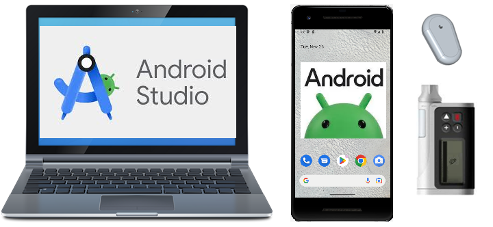

# 組件總覽

**AAPS** 不僅僅是一個（自建的）應用程式，它只是您封閉循環系統中幾個模組之一。 在決定組件之前，查看組件文件將是一個好主意。



```{admonition} IMPORTANT SAFETY NOTICE
:class: important

本文件中討論的 **AAPS** 安全功能的基礎，是建立在構建您系統所使用硬體的安全功能之上。 對於關閉自動胰島素給藥循環，僅使用經過測試、完全正常運作並由您國家的官方機構批准的胰島素幫浦和 CGM 是至關重要的。 對這些組件進行硬體或軟體修改可能會導致胰島素劑量異常，對使用者造成重大風險。 如果您找到或獲得破損、修改或自製的胰島素幫浦或 CGM 接收器，**請勿使用**這些來建立 **AAPS** 系統。

此外，僅使用製造商批准的原裝耗材，例如插入器、套管和胰島素容器，也同樣重要。 使用未經測試或修改的耗材可能會導致 CGM 不準確和胰島素劑量錯誤。 胰島素在劑量錯誤時極具危險 - 請勿透過修改耗材來冒生命危險。

最後但同樣重要的是，您必須避免服用 SGLT-2 抑制劑（gliflozins），因為它們會不計其數地降低血糖值。 這種藥物與一個降低基礎速率以增加血糖的系統結合使用時尤其危險，因為由於格列佛新的影響，血糖可能不會上升，可能導致缺乏胰島素的危險情況發生。 [這裡有更多資訊](#PreparingForAaps-no-sglt-2-inhibitors)。
```

## 必要模組

### 適合你的糖尿病治療的個性化劑量演算法

雖然這不是可以製作或購買的東西，但這是最容易被低估但卻至關重要的「模組」。 當你讓一個演算法幫助管理你的糖尿病時，他需要正確的設定才能避免嚴重錯誤。 即使您仍在缺少其他模組，您也可以在您的糖尿病團隊的協助下驗證和調整您的 **設定檔**。

該 **設定檔** 包含：

- BR（基礎率）：提供背景胰島素；
- ISF（胰島素敏感性因子）：一單位胰島素可以降低您的血糖值的幅度；
- CR（碳水比）：一單位胰島素能覆蓋多少克碳水化合物；
- DIA（胰島素作用時間）。

大多數使用閉環系統的人會使用日夜節律的 BR、ISF 和 CR，這些數值會根據一天中激素影響調整胰島素敏感性。

有關您的 **設定檔** 的更多資訊 [請見專頁](../SettingUpAaps/YourAapsProfile.md)。

### 手機

請參閱專頁 [智慧型手機](../Getting-Started/Phones.md)。

### 胰島素幫浦

請參閱專頁 [相容的幫浦](../Getting-Started/CompatiblePumps.md)。

**某些幫浦型號的優缺點**

Combo、Insight 及舊版 Medtronic 是穩定的幫浦，且可以迴路使用。 Combo 的優勢在於有更多類型的輸入套件可以選擇，因為它具有標準的 Luer-Lock。 而且其電池是您可以在任何加油站或 24 小時便利商店購買的預設電池，若您真的需要，還可以從酒店房間的遙控器上偷/借一個。;-)

然而，DanaR/RS 和 Dana-i 相對於 Combo 作為首選幫浦的優勢在於：

- Dana 幫浦可以與幾乎任何運作 Android 5.1 或更高版本的手機連線，而無需刷入 Lineage。 如果你的手機壞了，通常可以輕鬆找到與 Dana 幫浦相容的手機作為快速替代品......這對於 Combo 來說並不容易。 （隨著 Android 8.1 越來越普及，這種情況可能會改變）
- Dana-i/RS 的初始配對比較簡單。 但通常這只需要做一次，所以他僅在你想使用不同幫浦測試新功能時才有影響。
- 目前，Combo 使用螢幕解析進行工作。 總的來說，這效果不錯，但速度較慢。 對於閉環系統來說，這並不太重要，因為所有操作都在背景中進行。 不過，您需要連線的時間仍然相對較長，因此在進行注射和烹飪時，藍牙連線可能會斷開，這並不容易。
- Combo 在暫時性基礎率（TBR）結束時會震動，DanaR 在 SMB 時會震動（或發出嗶聲）。 在夜間，您可能會比小量注射（SMB）使用更多的臨時基礎率（TBR）。  Dana-i/RS 可配置為不會發出嗶聲或震動。
- 幾秒鐘內讀取 Dana-i/RS 的歷史紀錄及碳水化合物資料，使你可以在離線狀態下輕鬆切換手機，並在獲得一些 CGM 資料後立即繼續閉環操作。
- 所有與 **AAPS** 相容的幫浦在交貨時都是防水的。 只有 Dana 幫浦因其密封的電池艙和儲液槽填充系統在保固範圍內也具備防水性能。

### 血糖來源

請參閱專頁 [相容的 CGM](../Getting-Started/CompatiblesCgms.md)。

### **AAPS**-.apk 檔案

系統的主要組件。 要安裝應用程式，您必須先自己建立 apk 檔案。 安裝說明請見 [這裡](../SettingUpAaps/BuildingAaps.md)。

### 報告伺服器

報告伺服器顯示您的血糖和治療資料，並生成詳細分析報告。 目前有兩個報告伺服器可以與 AAPS 一起使用：[Nightscout](#SettingUpTheReportingServer-nightscout) 和 [Tidepool](#SettingUpTheReportingServer-tidepool)。 它們都提供可視化您的糖尿病資料的方式，提供有關 **目標範圍內**（TIR）及其他指標的統計資料。

報告伺服器獨立於其他模組。 如果您不想使用報告伺服器，請知道這在長期運行 **AAPS** 時並不是強制的。 但您仍需設置一個，因為這將是完成 [**目標 1**](#objectives-objective1) 的必要條件。

有關如何設置報告伺服器的更多資訊，可以在 [這裡](../SettingUpAaps/SettingUpTheReportingServer.md)找到。

## 可選模組

### 智慧型手錶

您可以選擇任何搭載 Android WearOS 1.x 至 4.x 的智慧手錶。 **請注意，WearOS 5.x 不相容！**

用戶正在建立一個[已測試的手機和手錶清單](#Phones-list-of-tested-phones)。 有不同的錶盤可供 **AAPS** 使用，您可以在 [這裡](../WearOS/WearOsSmartwatch.md)找到。

### xDrip+

即使您不需要使用 [xDrip+ 應用程式](https://xdrip.readthedocs.io/en/latest/) 作為 **BG 資料源**，您仍然可以使用它來設定 _例如_ 警報或不同的血糖顯示。 您可以設定任意多的警報，指定警報應該在什麼時間啟動，是否可以覆蓋靜音模式等。 有關一些 xDrip+ 資訊，請參閱[這裡](../CompatibleCgms/xDrip.md)。 請注意，這款應用程式的文件並非總是最新的，因為其進展相當快速。

## 等待模組期間該做什麼

有時候獲得所有模組以完成迴路需要一些時間。 但不用擔心，還有很多事情可以在等待期間進行。 確定需要檢查和（如有需要）調整基礎率（BR）、胰島素-碳水比（IC）、胰島素敏感性因子（ISF）等是**必要的**。 或許開放迴路可以是一個測試該系統並熟悉 **AAPS** 的好方法。 使用此模式，**AAPS** 會提供您可以手動執行的治療建議。

你可以繼續閱讀這裡的文件，與其他閉環系統用戶線上或離線交流，或[閱讀](../UsefulLinks/BackgroundReading.md)文件或其他用戶撰寫的內容（即使需要小心，不是所有內容都正確或適合你複製）。

**完成了嗎？** 如果您已經擁有所有 **AAPS** 組件（恭喜您！）或至少足夠開始使用開放迴路模式，您應該首先閱讀每個新目標的 [目標說明](../SettingUpAaps/CompletingTheObjectives.md) 並設置您的硬體。
